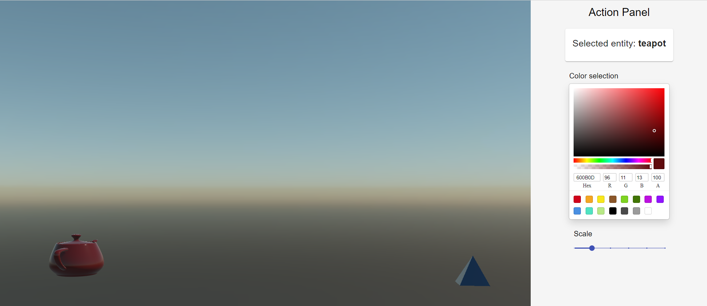

# Evergine.Workshop

## Introduction

Workshop that shows how to integrate the Evergine into an SPA using react. 

During this session, We will create some basic 3D primitives using the Evergine editor. We will add an Action Panel in our Web project to change the color and scale of our 3D shapes invoking webassembly methods.

## Getting Started

### 1. Install Evergine Launcher

- [Installer Evergine](https://waveeditor.blob.core.windows.net/installer/EvergineSetup.exe)

### 2. Install .NET dependencies

#### Prerequisites

1. (Optional - Recommended) [Visual Studio 2022](https://visualstudio.microsoft.com/es/thank-you-downloading-visual-studio/?sku=professional&ch=pre&rel=17)
2. (Required without VS2022) [Download](https://dotnet.microsoft.com/download/dotnet/6.0) latest dotnet SDK release (6.0.0-rc.2)
3. Install wasm-tools (root terminal): `dotnet workload install wasm-tools --skip-manifest-update`
4. Deactivate bullet on base project: `Evergine.Workshop/MyScene.cs:L15`,`Evergine.Workshop/Evergine.Workshop.csproj:L16`

-------

#### Build

Use VS2022 or VSCode/Terminal. You can build and test only the client project (Web), the server is only needed for publishing with compression (see below).

`dotnet build -c [Debug|Release] ./Evergine.Workshop.Web/Evergine.Workshop.Web.[Server.]csproj`

------

#### Run

From VS2022 you can run the profile `Evergine.Workshop.Web[.Server]`. There is also an IIS Express profile for each cliente and server projects, but it is usually slower.

Additionally you can publish the app

`dotnet publish -c [Debug|Release] ./Evergine.Workshop.Web/Evergine.Workshop.Web.csproj`

and run the app by populating the folder `./Evergine.Workshop.Web/bin/[Debug|Release]/net6.0/publish/wwwroot`. In this second case we do recommend to use VSCode Live Server, instead of Fenix, as the second has known issues with Web Assembly.

------

### 3. Configure and install web tools

#### **Install web tools**

1. Install the latest version of nodejs [nodejs](https://nodejs.org/es/download/). it includes npm

2. Install yarn

    `npm  -g install yarn`

3. Install project dependencies.

    `yarn install`

#### **Build and run the project**

Go to Evergine.Workshop.React/evergine.client folder and execute the following commands to build the project and run the server using craco.

The following command build our Evergine.Workshop project and will publish all the web webassembly files into the wwwroot/ directory. This task also copies all the content into the public/ folder of our React server.

`yarn build`

This command launch the web server.

`yarn start`

## Contribute

If you want to learn more about creating good readme files then refer the following [guidelines](https://docs.microsoft.com/en-us/azure/devops/repos/git/create-a-readme?view=azure-devops).

----
Powered by **[Evergine 3.3 preview](http://www.evergine.net)**

LET'S CONNECT!

- [Youtube](https://www.youtube.com/subscription_center?add_user=EvergineChannel)
- [Twitter](https://twitter.com/EvergineTeam)
- [Blog](http://geeks.ms/evergineteam/)
